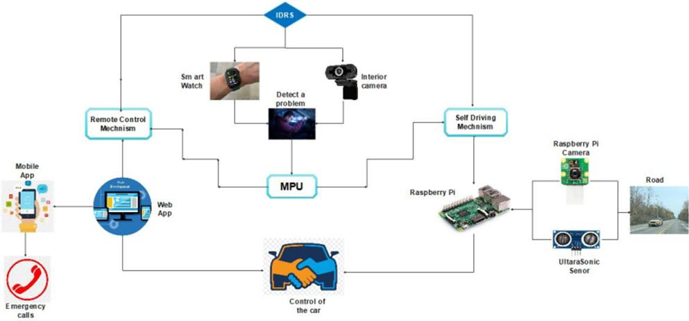
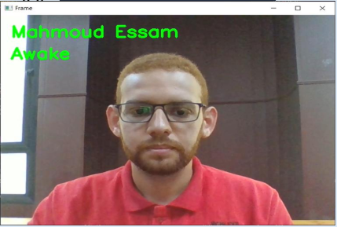
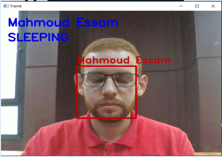
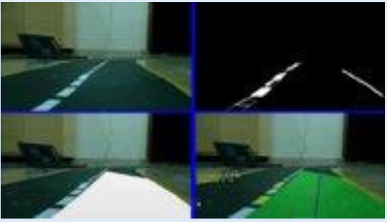
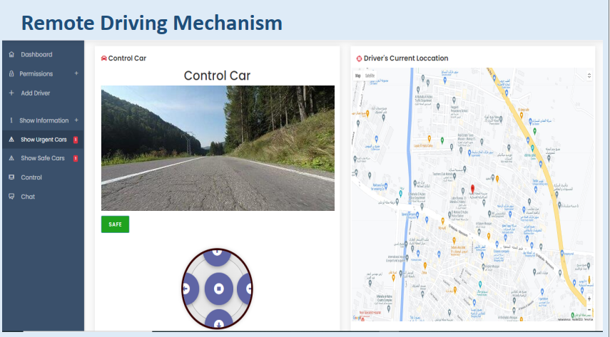

# Intelligent Driver Rescue System Based on AI and FOG Computing Technology

>Most of the car accidents are caused by human error, throughout the researches the general consensus among experts is that human error contributes to at least 90% of the auto accidents. The main cause to these errors is that, the driver may fall into a fainting state for any medical reason such as pressure problems, heart attacks, diabetes, etc. Also, the driver may fall asleep due to lack of sleep. Accordingly, these accidents cause traffic congestion for a long time and sometimes people pay their lives for it.

My graduation project will introduce a novel solution to this problem, specifically using AI and IOT technology . This solution will be implemented in two procedures;

**The first procedure** is detecting that there is a problem which is done by: 
Measuring the driver’s vital signs such as blood pressure, Heart rate and others using IOT tools. This phase is established to determine the driver’s health status on which we measure his ability to drive.
 Then analyzing the driver’s facial features such as his eye movement and facial expressions using AI tools. This phase is established to determine if the driver lost consciousness or fell asleep.
Based on the data which has been collected about the driver's health status, his geographical location and the vehicle’s information, an analysis routine will be performed. As a result, in the case of emergency the proposed IDRS system immediately takes the control and kick up a rescue process.

**The second procedure** is applying one of the system two mechanisms : 
This process starts by sending a rescue acknowledge to the remote control office . In conjunction with this step, the main processing  initializes a ***Self-Driving Mechanism*** to the vehicle, this process aimed to drive the vehicle until reaching the nearest safe place for parking (Using AI and IOT).
in case of self-driving mechanism failure due to environmental reasons, the second mechanism which is ***Remote Driving Mechanism*** will take control . their will be a human remote driving  from the remote control office.

**IDRS** will initiate a warning operation to the surrounding environment through a Sound-light warning alarm and sending an acknowledge to the surrounding vehicles through the V2V protocol (future work).

>This is a diagram to discribe the *architecture* and the *flow* of the system 

***This REPO will contain some of the source code to this project and some discribtion to how it works.***

*Know that we are using a **Raspberry Pi** as main controller to control the car and a **Laptop** as the system main office.* 

The platform contains the code to run the **Interior Camera** and apply face recognition and eye detection to determine if the driver is conscious or not, Also the method to take the *status* from the **Interior Camera** and the **Smart Watch** to detrmine the driver exact medical condition then in case of a problem this file contains method to activate the system (Called **SystemActivate**) 

>***Interior Camera***

 

***SystemActivate*** will first call a method called **makeRequest** to make changes in the website to change the driver status from *stable* to *danger*

then will call a method called **RunFile** to access the raspberry pi using SSH connection and run the ***Self-Driving Mechanism*** then if there is a problem it will close and run the ***Remote Driving Mechanism*** 

>This is the [Platform](Source_Code\Full_Platform\system_Activate.py) code 

**The Self-Driving Mechanism** uses opencv and numpy and other libraries to apply lane and line detection to make the correct decisions to make the car move correctly

>This is the output of **The Self-Driving Mechanism**

>This is the [Self-Driving Mechanism](Source_Code\Self_Driving_Mechanism\enhancedLaneDetection.py) code 

**The Remote Driving Mechanism** Uses Flask and other libraries
to create a web page that shows the live feed from the front camera and some buttons to control the car
>Output of **The Remote Driving Mechanism**
 

>This is the [Remote Driving Mechanism](Source_Code\Remote_Driving_Mechanism\app.py) code 

***This is the [Project Book](Resources\Book) For full project details***